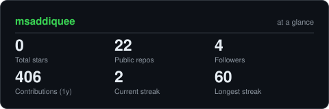

<div align="center">

  <!-- PORTRAIT - generated by scripts/dotify.py from assets/jacket.png.
      Colour mode, so one file serves both GitHub themes. Regenerate with:
        python scripts/dotify.py assets/jacket.png -o assets/portrait \
          --cols 100 --equalize --detail 0.5 --color -->
  <!--  -->

  <br>

  <!-- NAME / TAGLINE - animated typing -->
  <a href="https://github.com/msaddiquee">
    
  </a>

  <br>

  <!-- SOCIALS -->
<p align="center">
  <a href="https://www.linkedin.com/in/muhammad-saddique-864881416/"></a>
  <a href="mailto:saddiquem2010@gmail.com"></a>
  <a href="https://x.com/yourusername"></a>
</p>
  <!-- <a href="https://dossier-iota-one.vercel.app"></a> -->

  <!-- <a href="https://codeforces.com/profile/gargibhardwaj24"></a>

  <a href="https://leetcode.com/u/gargibhardwaj24"></a> -->


  <!--  -->
</div>

---

## `~/` whoami

```console
$ cat about.txt
```

Hi, I'm **Muhammad Saddique**. I build things that sit somewhere between machine learning and the web,
and I solve problems for fun when neither of those is cooperating.

<!-- - Currently building **[Sage](https://github.com/gargibhardwaj24/Sage)** and **[Spyder](https://github.com/gargibhardwaj24/spyder_frontend)**
- Portfolio: **[dossier-iota-one.vercel.app](https://dossier-iota-one.vercel.app)** -->
- Learning **React + Machine Learning**
- Fun fact: **I started coding seriously because I wanted to build things I wished existed.**

<br>

<div align="center">

  ## `~/` tool box

  ### 🎨 Frontend Universe
  

  ### ⚙️ Backend Powerhouse
  

  ### 🗄️ Database & Cloud
  

  ### 🛠️ Tools & Platforms
  

</div>

---

<div align="center">

## `~/` contribution calendar

<!-- 3D isometric calendar, regenerated every 6h by .github/workflows/metrics.yml -->


<!-- <br><br> -->

<!-- Snake eats the contribution graph - .github/workflows/snake.yml -->
<!-- <picture>
  <source media="(prefers-color-scheme: dark)"  srcset="https://raw.githubusercontent.com/msaddiquee/msaddiquee/output/snake-dark.svg">
  <source media="(prefers-color-scheme: light)" srcset="https://raw.githubusercontent.com/msaddiquee/msaddiquee/output/snake.svg">
  
</picture> -->

</div>

---

<div align="center">

## `~/` the numbers

<!-- Generated by scripts/cards.py into this repo. Deliberately NOT
     github-readme-stats / streak-stats / github-profile-trophy: those are
     shared public instances that go down and take the whole section with them. -->
<picture>
  <source media="(prefers-color-scheme: dark)"  srcset="assets/card-stats-dark.svg">
  <source media="(prefers-color-scheme: light)" srcset="assets/card-stats-light.svg">
  
</picture>

<br>


<!-- <br><br>

 -->

</div>

---

<!-- <div align="center"> -->

<!-- ## `~/` selected work -->

<!-- Cards generated by scripts/cards.py from assets/projects.json.
     Stars, forks and language are pulled live from the API on every run. -->
<!-- <table>
<tr>
<td width="50%">
  <a href="https://github.com/gargibhardwaj24/dossier">
    <picture>
      <source media="(prefers-color-scheme: dark)"  srcset="assets/card-dossier-dark.svg">
      <source media="(prefers-color-scheme: light)" srcset="assets/card-dossier-light.svg">
      
    </picture>
  </a>
</td>
<td width="50%">
  <a href="https://github.com/gargibhardwaj24/Sage">
    <picture>
      <source media="(prefers-color-scheme: dark)"  srcset="assets/card-Sage-dark.svg">
      <source media="(prefers-color-scheme: light)" srcset="assets/card-Sage-light.svg">
      
    </picture>
  </a>
</td>
</tr>
<tr>
<td width="50%">
  <a href="https://github.com/gargibhardwaj24/Socrates">
    <picture>
      <source media="(prefers-color-scheme: dark)"  srcset="assets/card-Socrates-dark.svg">
      <source media="(prefers-color-scheme: light)" srcset="assets/card-Socrates-light.svg">
      
    </picture>
  </a>
</td>
<td width="50%">
  <a href="https://github.com/gargibhardwaj24/humanOS">
    <picture>
      <source media="(prefers-color-scheme: dark)"  srcset="assets/card-humanOS-dark.svg">
      <source media="(prefers-color-scheme: light)" srcset="assets/card-humanOS-light.svg">
      
    </picture>
  </a>
</td>
</tr>
</table> -->

<sub>

<!-- | project | live | stack |
|---|---|---|
| **[dossier](https://github.com/gargibhardwaj24/dossier)** | [dossier-iota-one.vercel.app](https://dossier-iota-one.vercel.app) | `JavaScript` `GSAP` `Lenis` |
| **[Sage](https://github.com/gargibhardwaj24/Sage)** | [sage-calendar.vercel.app](https://sage-calendar.vercel.app) | `JavaScript` |
| **[Socrates](https://github.com/gargibhardwaj24/Socrates)** | [socrates-one-coral.vercel.app](https://socrates-one-coral.vercel.app) | `Next.js` `Prisma` `TypeScript` |
| **[humanOS](https://github.com/gargibhardwaj24/humanOS)** | [human-os-two.vercel.app](https://human-os-two.vercel.app) | `JavaScript` `Gemini` | -->

<!-- </sub>

</div>

<!-- --- -->

<!-- <div align="center"> -->

<!-- <sub>`01110100 01101000 01100001 01101110 01101011 01110011 00100000 01100110 01101111 01110010 00100000 01110011 01100011 01110010 01101111 01101100 01101100 01101001 01101110 01100111`</sub> -->

<!-- </div> -->
